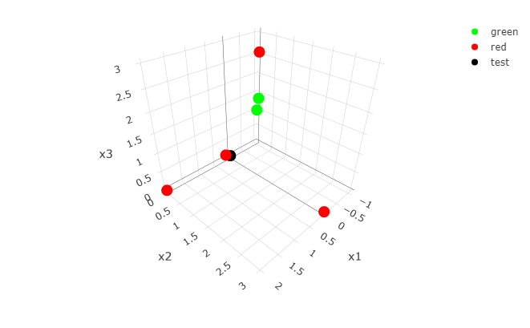
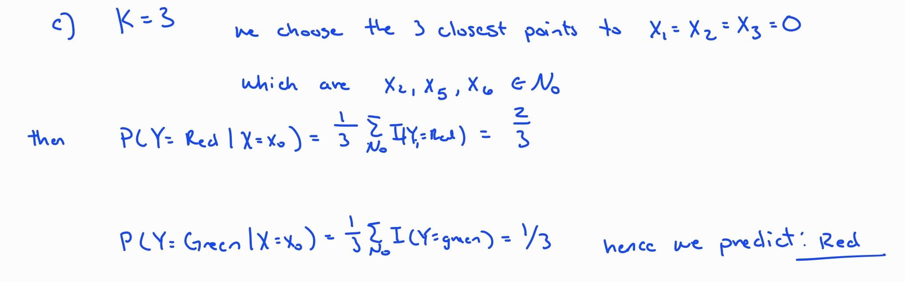
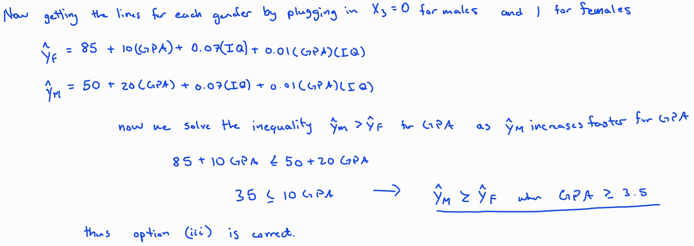

```{r setup, include=FALSE}
knitr::opts_chunk$set(echo = TRUE)
library(tidyverse)
library(plotly)
library(ISLR2)

```

# Chapter 2

### Conceptual Problems

5.  What are the advantages and disadvantages of a very flexible (versus a less flexible) approach for regression or classification? Under what circumstances might a more flexible approach be preferred to a less flexible approach? When might a less flexible approach be preferred?

    -   Taking a flexible approach to regression and classification is one where we typically fit non-linear models with this as it allows for more parameters compared to inflexible which typically takes very few parameters.

    -   Advantages of the flexible model are that it reduces the Bias or error of the model compared to the inflexible where we would try to fit a linear model to something that is not linear which may increase the prediction error. Now these advantages do not always lead to great things, some disadvantages could be that the more flexible model would lead to **overfitting**, which means that the randomness, error, or noise of the data is followed to closely magnifying the error of the model.

    -   Now flexible models seem to give the most bang for the buck but sometimes the inflexible model is preferred. This would happen if you are more interested in drawing some type of inference of the data or interpreting it. An example of this would be taking a linear model as it would let you understand the relationship between Y and the predictors.

6.  Describe the difference between a parametric and a non-parametric statistical learning approach. What are the advantages of a parametric approach to regression or classification( as opposed to a non-parametric approach)? What are the disadvantages?

    -   The main difference between parametric and non-parametric approaches is that parametric makes an original assumption about the functional form of the predictors. While non-parametric does not make this assumption.

    -   The advantages of a parametric approach are that it does not necessarily require a large sample to perform, but with the original assumption we run the risk of assuming the incorrect form of the function. Now with non-parametric approaches we have the opportunity to accurately fit a wider range of possible shapes of the function. But with this comes the need for very large samples sizes.

    \newpage

7.  The table below provides a training data set containing six observations, three predictors, and one qualitative response variable.

    | OBS | $X_{1}$ | $X_{2}$ | $X_{3}$ |  $Y$  |
    |:---:|:-------:|:-------:|:-------:|:-----:|
    |  1  |    0    |    3    |    0    |  Red  |
    |  2  |    2    |    0    |    0    |  Red  |
    |  3  |    0    |    1    |    3    |  Red  |
    |  4  |    0    |    1    |    2    | Green |
    |  5  |   -1    |    0    |    1    | Green |
    |  6  |    1    |    1    |    1    |  Red  |

Suppose we wish to use this data set to make a prediction for $Y$ when $X_{1} = X_{2} = X_{3} = 0$ using K-nearest neighbors. A scatter plot is given below.

```{r}
dat <- data.frame(x1 = c(0,0,2,0,0,-1,1), 
                  x2 = c(0,3,0,1,1,0,1),
                  x3 = c(0,0,0,3,2,1,1), 
                  y = c('test','red','red','red','green','green','red'))

fig <- plot_ly(dat, x = ~x1, y = ~x2, z = ~x3, color = ~y, 
               colors = c('green','red','black'), 
               type = 'scatter3d', 
               mode = 'markers')
```

{width="706"}

a.  Compute the Euclidean distance between each observation and the test point, $X_{1} = X_{2} = X_{3} = 0$

    ```{r}
    # Euclidean distance is given by the formula 
    # ED(p,q) = sqrt((p1-q1)^2 + (p2-q2)^2 + (p3-q3)^2)
    ED <- sqrt(c(0,2,0,0,-1,1)^2 + c(3,0,1,1,0,1)^2 + c(0,0,3,2,1,1)^2)

    for (i in seq(1,6)){
        print(paste("Observation:",i,'Distance:',round(ED[i],2)))
    }
    ```

b.  What is our prediction with K = 1? Why?

    -   The formula we use to predict is given by $P(Y=j|X = x_{0}) = \frac{1}{K}\sum_{i \in N_{0}}I(y_{i} = j)$

    

c.  What is our prediction with K = 3? Why?

    

d.  If the Bayes decision boundary in this problem is highly non-linear, then would we expect the *best* value for K to be large or small? Why?

    -   If the Bayes decision boundary is highly non-linear the best K would be small as the smaller the value of K the more flexible the decision boundary is. Larger K values give more of a linear decision boundary.

# Chapter 3

### Conceptual Problems

1.  Describe the null hypotheses to which the p-values given in Table 3.4 correspond. Explain what conclusions you can draw based on these p-values. Your explanation should be phrased in terms of *sales*, *TV*, *radio*, and *newspaper*, rather than in terms of the coefficients of the linear model.

    | Predictor | Coefficient | Std. Error | t-statistic | p-value  |
    |-----------|-------------|------------|-------------|----------|
    | Intercept | 2.939       | 0.3119     | 9.42        | \<0.0001 |
    | TV        | 0.046       | 0.0014     | 32.81       | \<0.0001 |
    | Radio     | 0.189       | 0.0086     | 21.89       | \<0.0001 |
    | Newspaper | -0.001      | 0.0059     | -0.18       | 0.8599   |

    -   From the table we can see that it gives the following tests, $H_{0}: \beta_{i} = 0$ for all the predictors. In this case we can see that TV and Radio advertising have a relationship with the amount of Sales. While Newspaper advertising does not have such a relationship.

2.  Carefully explain the differences between the KNN classifier and KNN regression methods.

    -   KNN regression is a non-parametric method for regression. Here we are trying to predict a quantitative response variable at a given point. Like the KNN classification we also look at the Neighborhood around the point, but instead of choosing the prediction based on probability we use the average of all the points in that specific Neighborhood.

3.  Suppose we have a data set with five predictors,$X_{1}$= GPA, $X_{2}$= IQ, $X_{3}$= Gender(1 for Female and 0 for Male), $X_{4}$= Interaction between GPA and IQ, and $X_{5}$= Interaction between GPA and Gender. The response is starting salary after graduation (in thousands of dollars). Suppose we use least squares to fit the model, and get $\hat\beta_{0}=50$ , $\hat\beta_{1}=20$ , $\hat\beta_{2}=0.07$ , $\hat\beta_{3}=35$, $\hat\beta_{4}=0.01$ , $\hat\beta_{5}=-10$.

    (a) Which answer is correct, and why ?

        i.  For a fixed value of IQ and GPA, males earn more on average than females.
        ii. For a fixed value of IQ and GPA, females earn more on average than males.
        iii. For a fixed value of IQ and GPA, males earn more on average than females provided that the GPA is high enough.
        iv. For a fixed value of IQ and GPA, females earn more on average than males provided that the GPA is high enough.

        

    (b) Predict the salary of a female with IQ of 110 and a GPA of 4.0.

        -   We plug the values for the predictors in the least squares line and multiplying by 1,000. This tells us that a Female with an IQ of 110 and a GPA of 4.0 will have a starting salary of \$ `r format((85+10*(4.0)+0.07*(110)+0.01*(4.0)*(110))*1000,big.mark = ",")`.

    ```{r}

    (85+10*(4.0)+0.07*(110)+0.01*(4.0)*(110))*1000

    ```

    (c) True or False: Since the coefficient for the GPA/IQ interaction term is very small, there is very little evidence of an interaction effect. Justify your answer.

        -   The statement is False. The way to test if there is a significant interaction with between a response variable and the predictor is by using an t-test. Since we do not have that information we cannot say for sure if the interaction term has an effect.

4.  I collect a set of data ( n = 100 observations) containing a single predictor and a quantitative response. I then fit a linear regression model to the data, as well as a separate cubic regression, i.e. $Y = \beta_{0} + \beta_{1}X +\beta_{2}X^{2} + \beta_{3}X^{3}+ \epsilon$.

    a.  Suppose that the true relationship between X and Y is linear, i.e. $Y = \beta_{0}+\beta_{1}X+\epsilon$. Consider the training residual sum of squares (RSS) for the linear regression, and also the training RSS for the cubic regression. Would we expect one to be lower than the other, would we expect them to be the same, or is there not enough information to tell? Justify your answer.

        -   The cubic regression may fit the training data better than the linear model as it would try to find the best pattern in the training set. This could give the appearance of non linearity just because of the randomness in collecting the data, but without looking at the data, we cannot be certain.

    b.  Answer (a) using test rather than training RSS.

        -   Now considering the test data we would expect the linear model to have lower RSS as it would predict what the true relationship is compared to the cubic regression that would be over fitting the data.

    c.  Suppose that the true relationship between X and Y is not linear, but we don't know how far it is from linear. Consider the training RSS for the linear regression, and also the training RSS for the cubic regression. Would we expect one to be lower than the other, would we expect them to be the same, or is there not enough information to tell? Justify your answer.

        -   The linear regression may fit the training data better than the cubic model as it would try to find the best pattern in the training set. This could give the appearance of linearity just because of the randomness in collecting the data, but without looking at the data, we cannot be certain.

    d.  Answer (c) using test rather than training RSS.

        -   Now considering the test data we would expect the cubic model to have lower RSS as it would predict something that is closer to the true relationship of the data, comparedd to the linear regression that would be under fitting the data.

5.  Consider the fitted values that result from performing linear regression without an intercept. In this setting, the *i*th fitted value takes the form

    $$
    \hat y_{i} = x_{i}\hat\beta
    $$

    where

    $$
    \hat\beta = (\sum_{i=1}^{n}{x_{i}y_{i}})/(\sum_{i'=1}^{n}{x_{i'}^2})
    $$

    Show that we can write

    $$
    \hat y_{i} = \sum_{i'=1}^{n}{a_{i'}y_{i'}}
    $$

    What is $a_{i'}$ ?


### Applied Problems

8.  This question involves the use of simple linear regression on the **Auto** data set.

    a.  Use the **lm()** function to perform a simple linear regression with *mpg* as the response and *horsepower* as the predictor. Use the **summary()** function to print the results. Comment on the output. For example:

    ```{r Simple Linear Regression}
    lm.fit <- lm(mpg ~ horsepower, data = Auto)
    print( mean(Auto$mpg))
    summary(lm.fit)
    ```

    i.  Is there a relationship between the predictor and the response?

        -   From the output we can see that our **F-statistic** is large( 599.7 ) and the associated **p-value** (2.2e-16) is very small. This indicates that there is clear evidence of a relationship between mpg and horsepower.

    ii. How strong is the relationship between the predictor and the response?

        -   To start we have a $R^2$ value of 0.6059, this means that roughly 61% of the variance in *mpg* can be explained by the predictor, *horsepower*. The we have a RSE value of 4.906 with a mean response value of 23.44592, which indicates a percentage error of roughly 21%. This shows that the relationship is there but there seem to be other factors that contribute to mpg.

    iii. Is the relationship between the predictor and the response positive or negative?

         -   Since the estimated coefficient for the predictor is negative (-0.157845), that means that for every unit increase in *horsepower*, the *mpg* will decrease. Thus the relationship between the predictor and response is negative.

    iv. What is the predicted *mpg* associated with a *horsepower* of 98? What are the associated 95% confidence and prediction intervals?

        -   From the information below we see that our predicted value for MPG is 24.46708. The confidence interval for the mean *mpg* given *horsepower* = 98 is (23.97308 , 24.96108). Then the prediction interval is (14.8094, 34.12476).

    ```{r Prediction/Confidence Intervals}
    predict(lm.fit, data.frame(horsepower = c(98)),interval = 'confidence')
    predict(lm.fit, data.frame(horsepower = c(98)),interval = 'prediction')
    ```

    b.  Plot the response and the predictor. Use the **abline()** function to display the least squares regression line.

    ```{r Simple Response VS Predictor Plot}
        # Predictor     # Response
    plot(Auto$horsepower, Auto$mpg, 
         main = 'MPG vs. Horsepower',
         sub = 'With Least Squares Regression Line',
         xlab = 'Horsepower',
         ylab = 'MPG')
    abline(lm.fit, col = 'red')
    ```

    c.  Use the **plot()** function to produce diagnostic plots of the least squares regression fit. Comment on any problems you see with the fit.

        -   From the Residuals vs Fitted plot we can see that there is a clear patter in the points. This indicates non-linearity in the data. If the plot was more random, no pattern easily noticeable, then the relationship would be a proper fit.

    ```{r Simple Regression Diagnostic Plots}
    par(mfrow = c(2,2))
    plot(lm.fit)
    ```

9.  This question involves the use of multiple linear regression on the Auto data set.

    a.  Produce a scatterplot matrix which includes all of the variables in the data set.

    ```{r Scatterplot}
    pairs(Auto,panel = panel.smooth)
    ```

    b.  Compute the matrix of correlations between the variables using the function **cor()**. You will need to exclude the name variable, which is qualitative.

    ```{r Correlation Matrix, fig.show = "hold"}
    cor(Auto[,-9])
    ```

    c.  Use the **lm()** function to perform a multiple linear regression with mpg as the response and all other variables except name as the predictors. Use the **summary()** function to print the results. Comment on the output. For instance:

    ```{r Multiple Regression}
    #     Response ~ All other variables - variable you dont want
    lm.mult_fit <- lm(mpg ~ . - name, data = Auto)
    summary(lm.mult_fit)
    ```

    i.  Is there a relationship between the predictors and the response?

        -   From the output we see that the **F-Statistic** is very large (252.4) with a **p-value** of (\<2.2e-16 ). This indicates that *mpg* is related to at lease one of the predictors.

    ii. Which predictors appear to have a statistically significant relationship to the response?

        -   We look at the **p-values** associated with each predictor to measure the relationship between each individual predictor and the response. With that in mind we see that the only predictors **not** significant are *cylinders*, *horsepower*, and *acceleration*.

    iii. What does the coefficient for the year variable suggest?

         -   The positive coefficient indicates that *mpg* increases from year to year, provided that all other variables are kept constant.

    <!-- -->

    d.  Use the **plot()** function to produce diagnostic plots of the linear regression fit. Comment on any problems you see with the fit. Do the residual plots suggest any unusually large outliers? Does the leverage plot identify any observations with unusually high leverage?

    ```{r Multiple Regression Diagnostic Plots}
    par(mfrow = c(2,2))
    plot(lm.mult_fit)
    ```

    As this is a multiple regression we have the residuals plotted with the predicted, fitted, values. In the best case we wish to see no discernible patter in the plot. Looking at our data we can see that there is a pattern in the residuals vs fitted plot indicating non-linearity. From the same plot we do see the presence of outliers. There are also points that have high leverage, which means that they are unusually high compared to other values in the set.

    e.  Use the \* and : symbols to fit linear regression models with interaction effects. Do any interactions appear to be statistically significant?

    ```{r Interaction Effections}
    lm.inter <- lm(mpg ~ displacement*weight + 
                         weight*year + cylinders*horsepower, data = Auto)
    summary(lm.inter)
    ```

    The output shows that all interaction effects are significant at the .05 level.

    f.  Try a few different transformations of the variables, such as $log(X), \sqrt(X),X^{2}$. Comment.

        From the scatter plot we see that horsepower and mpg do not have a linear relationship.

    ```{r MLR with Transformations}
    lm.sq <- lm(mpg ~ I(horsepower^2), data = Auto)
    summary(lm.sq)
    ```

    ```{r}
    lm.log <- lm(mpg ~ log(horsepower), data = Auto)
    summary(lm.log)
    ```

    ```{r}
    lm.sqrt <- lm(mpg ~ sqrt(horsepower), data = Auto)
    summary(lm.sqrt)
    ```

    Looking at all three outputs we see that the log transformation gives the highest **F-Statistic** indicating that it has the most prominent relationship. This is confirmed when looking at the plot of each transformation with *mpg*. The log transformation looks the most linear.

    ```{r}
    par(mfrow = c(2,2))
    plot(Auto$horsepower, Auto$mpg)
    plot(log(Auto$horsepower), Auto$mpg)
    plot(sqrt(Auto$horsepower), Auto$mpg)
    ```

    11. In this problem we will investigate the t-statistic for the null hypothesis $H_{0}:\beta = 0$ in simple linear regression without an intercept. To begin, we generate a predictor x and a response y as follows.

    ```{r Question Set, }
    set.seed (1)
    x <- rnorm (100)
    y <- 2 * x + rnorm (100)
    ```

    a.  Perform a simple linear regression of **y** onto **x**, without an intercept. Report the coefficient estimate $\hat\beta$, the standard error of this coefficient estimate, and the t-statistic and p-value associated with the null hypothesis $H_{0}:\beta=0$. (You can perform regression without an intercept using the command **lm(y\~x + 0)**.

    ```{r}
    lm.syx <- lm(y~x +0)
    summary(lm.syx)
    ```

    Our Coefficient is 1.9939, with error 0.1065, t-stat 18.73, and p-value \<2e-16

    b.  Perform a simple linear regression of **x** onto **y**, without an intercept. Report the coefficient estimate $\hat\beta$, the standard error of this coefficient estimate, and the t-statistic and p-value associated with the null hypothesis $H_{0}:\beta=0$. (You can perform regression without an intercept using the command **lm(y\~x + 0)**.

    ```{r}
    lm.sxy <- lm(x~y +0)
    summary(lm.sxy)
    ```

    Our Coefficient is 0.39111, with error 0.02089, t-stat 18.73, and p-value \<2e-16

    c.  What is the relationship between the results obtained in (a) and (b)?

        -   We can see that the coefficients follow the inverse of each other compared to the original equation we used to make the data.

    d.  For the regression of Y onto X without an intercept, the t-statistic for $H_{0}:\beta = 0$ takes the form $\hat\beta/SE(\hat\beta)$ where $\hat\beta$ is given by (3.38), and where $$
        SE(\hat\beta) = \sqrt{ \frac{\sum_{i=1}^n{(y_{i}-x_{i}\hat\beta)^2}}{(n-1)\sum_{i'=1}^n{x_{i'}^2}}}
        $$

        These formulas are slightly different from those given in Sections 3.1.1 and 3.1.2, since here we are performing regression without an intercept.) Show algebraically, and confirm numerically in R, that the t-statistic can be written as

        $$
        \frac{(\sqrt{n-1})\sum_{i=1}^n{x_iy_i}}{\sqrt{(\sum_{i=1}^n{x_i^2})(\sum_{i'=1}^n{y_{i'}^2})-(\sum_{i'=1}^n{x_{i'}y_{i'}})^2}}
        $$


```{r}
# Verifying in R
n <- length(x)
sxy <- sum(x*y)
sxx <- sum(x*x)
syy <- sum(y*y)
sxy2 <- sum(x*y)^2

tstat <- (sqrt(n-1)*sxy)/(sqrt((sxx*syy)-sxy2))
tstat
summary(lm.sxy)$coefficients[,'t value']
```

e.  Using the results from (d), argue that the t-statistic for the regression of y onto x is the same as the t-statistic for the regression of x onto y.

    -   From d we see that the t statistic is completely reliant on the predictor and response. Thanks to the commutative property all of the operations are the same whether x is the response or predictor.

f.  In R, show that when regression is performed *with* an intercept, the t-statistic for $H_{0}:\beta_1 = 0$ is the same for the regression of **y onto x** as it is for the regression of **x onto y**.

```{r}
lm.in <- lm(x ~ y )
summary(lm.in)
```

```{r}
lm.inyx <- lm(y ~ x )
summary(lm.inyx)
```

We can see that in both regressions the t-statistic is 18.56.

```{r}
summary(lm.in)$coefficients[,'t value']
summary(lm.inyx)$coefficients[,'t value']
```
