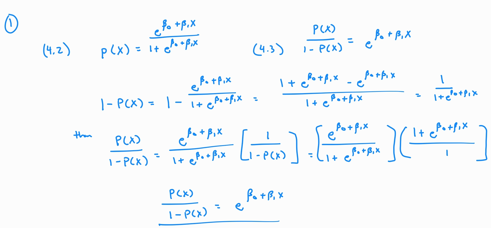
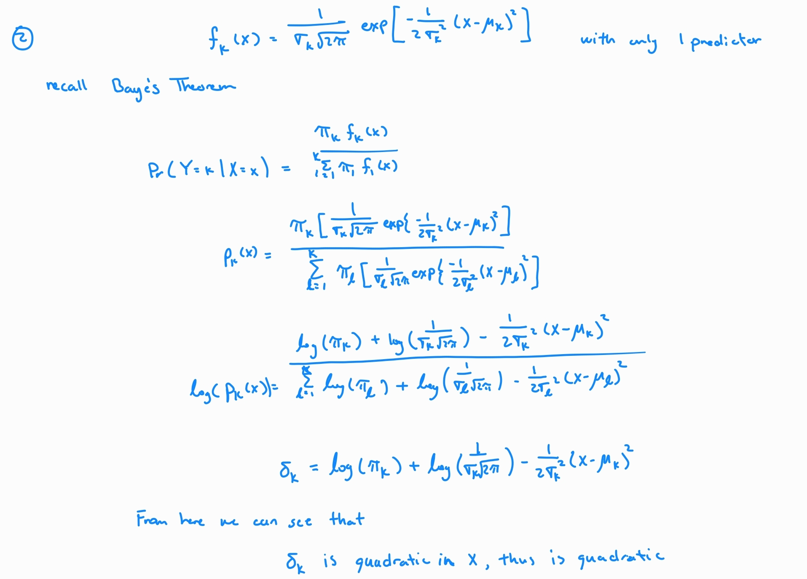
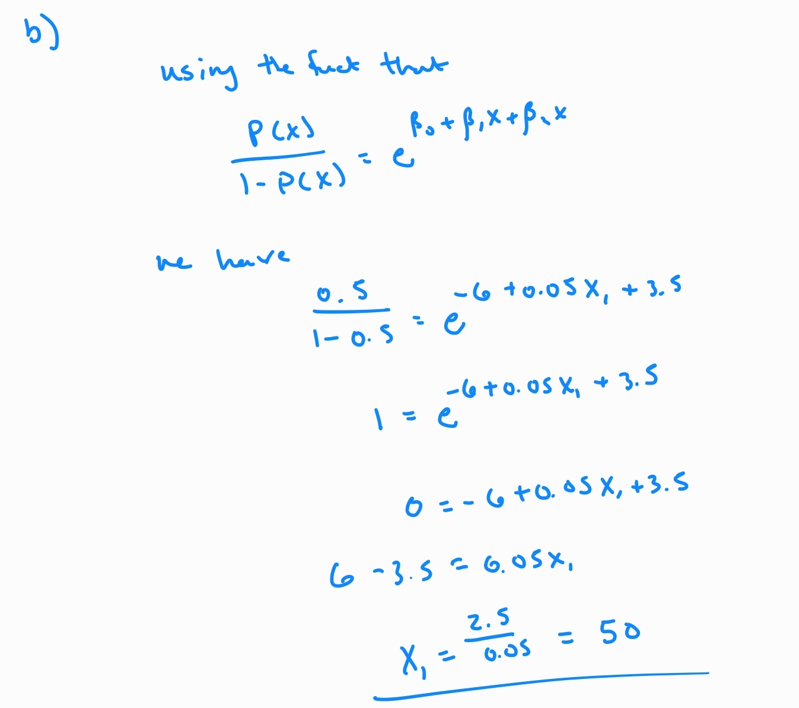

```{r setup, include=FALSE}
knitr::opts_chunk$set(echo = TRUE)
suppressPackageStartupMessages(library(tidyverse))
library(corrplot)
library(olsrr)
library(car)
library(RCurl)
library(ISLR2)
```

# From Text Book

## Conceptual Problems

### Problem 1

Using a little bit of algebra, prove that (4.2) is equivalent to (4.3). In other words, the logistic function representation and logit representation for the logistic regression model are equivalent.



### Problem 3

This problem relates to the QDA model, in which the observations within each class are drawn from a normal distribution with a class-specific mean vector and a class specific covariance matrix. We consider the simple case where p = 1; i.e. there is only one feature.

Suppose that we have **K** classes, and that if an observation belongs to the *k*th class then **X** comes from a one-dimensional normal distribution, $X \sim N(\mu_k,\sigma_k^2)$. Recall that the density function for the one-dimensional normal distribution is given in (4.16). Prove that in this case, the Bayes classifier is *not* linear. Argue that it is in fact quadratic.

{width="611"}

### Problem 4

When the number of features *p* is large, there tends to be a deterioration in the performance of **KNN** and other *local* approaches that perform predictions using only observations that are *near* the test observation for which a prediction must be made. This phenomenon is known as the *curse of dimensionality*, and it ties into the fact that non-parametric approaches often perform poorly when *p* is large. We will now investigate this curse.

(a) Suppose that we have a set of observations, each with measurements on p = 1 feature, X. We assume that X is uniformly (evenly) distributed on \[0, 1\]. Associated with each observation is a response value. Suppose that we wish to predict a test observation's response using only observations that are within 10% of the range of X closest to that test observation. For instance, in order to predict the response for a test observation with X = 0.6, we will use observations in the range \[0.55, 0.65\]. On average, what fraction of the available observations will we use to make the prediction?

(b) Now suppose that we have a set of observations, each with measurements on p = 2 features,$X_1$ and $X_2$. We assume that ($X_1,X_2$)are uniformly distributed on $[0,1] \times [0,1]$. We wish to predict a test observation's response using only observations that are within 10% of the range of $X_1$ *and* within 10% of the range of $X_2$ closest to that test observation. For instance, in order to predict the response for a test observation with $X_1 = 0.6$ and $X_2 = 0.35$, we will use observations in the range \[0.55,0.65\] for $X_1$ and in the range \[0.3,0.4\] for $X_2$. On average, what fraction of the available observations will we use to make the predictions?

(c) Now suppose that we have a set of observations on p = 100 features. Again the observations are uniformly distributed on each feature, and again each feature ranges in value from 0 to 1. We wish to predict a test observation's response using observations within the 10% of each feature's range that is closest to that test observation. What fraction of the available observations will we use to make the prediction?

(d) Using your answers to parts (a)--(c), argue that a drawback of KNN when p is large is that there are very few training observations "near" any given test observation.

(e) Now suppose that we wish to make a prediction for a test observation by creating a p-dimensional hypercube centered around the test observation that contains, on average, 10% of the training observations. For p = 1, 2, and 100, what is the length of each side of the hypercube? Comment on your answer.

### Problem 6

Suppose we collect data for a group of students in a statistics class with variables $X_1=$hours studied, $X_2=$ undergrad GPA, and $Y=$ receive an A. We fit a logistic regression and produce estimated coefficient, $\hat \beta_0=-6$, $\hat \beta_1=0.05$, $\hat \beta_2=1$.

a.  Estimate the probability that a student who studies for 40 h and has an undergrad GPA of 3.5 gets an A in the class.

-   Using the multiple logistic regression equation given below we can get the probability of an A.

$$
P(X) = \frac{e^{\beta_0+\beta_1X_1+\beta_2X_2}}{1+e^{\beta_0+\beta_1X_1+\beta_2X_2}}
$$

```{r}
# Given constants
Hours <- 40
GPA <- 3.5

#Probability using multiple logistic regression
Px <- (exp(-6 +0.05*Hours + 1*GPA ))/(1 + exp(-6 +0.05*Hours + 1*GPA ))
```

-   Using the above code we can see that the probability of the particular student getting an A in the class is `r round(Px,3)`

b.  How many hours would the student in part (a) need to study to have a 50% chance of getting an A in the class.

{width="524"}

-   We see that in order to have a 50% of getting an A a student with a GPA of 3.5 needs to study 50 hours.

### Problem 8

Suppose that we take a data set, divide it into equally-sized training and test sets, and then try out two different classification procedures. First we use logistic regression and get an error rate of 20% on the training data and 30% on the test data. Next we use 1-nearest neighbors (i.e. K = 1) and get an average error rate (averaged over both test and training data sets) of 18 %. Based on these results, which method should we prefer to use for classification of new observations? Why?

-   The best method is going to be the one with the lowest test error rate. We are given the logistic test error rate at 30% but the KNN error rate is average between the test and the training, at 18% average. This means we need to calculate the KNN test error rate to make a decision.

-   As K = 1, we know that in the training data set they are using a single neighbor to make a prediction. Thus the error would be 0 since we are using the point to make a prediction about that specific point. This tells us that the training error rate is 2\*18% = 36%. Then we would choose the Logistic Regression Method.

## Applied Problems

### Problem 10

This question should be answered using the Weekly data set, which is part of the ISLR2 package. This data is similar in nature to the Smarket data from this chapter's lab, except that it contains 1,089 weekly returns for 21 years, from the beginning of 1990 to the end of 2010.

a.  Produce some numerical and graphical summaries of the Weekly data. Do there appear to be any patterns?

```{r}
# Numerical Summaries
summary(Weekly)

# Remove the non-numeric predictor
week_cor <- cor(Weekly[,-9])

corrplot(week_cor,type = 'upper' ,method = 'pie')
```

```{r}
# Graphical Summaries
plot(Weekly$Year, Weekly$Volume)
```

b.  Use the full data set to perform a logistic regression with *Direction* as the response and the five *lag* variables plus *Volume* as predictors. Use the summary function to print the results. Do any of the predictors appear to be statistically significant? If so, which ones?

```{r}
log.model <- glm(Direction ~ Lag1 + Lag2 + Lag3 + Lag4 + Lag5 + Volume, data = Weekly, family = binomial)

summary(log.model)

```

-   From the output we can see that only Lag2 has a p-value of less than 0.05, meaning it is the only predictor that is statistically significant.

c.  Compute the confusion matrix and overall fraction of correct predictions. Explain what the confusion matrix is telling you about the types of mistakes made by logistic regression.

```{r}

```

b.  Now fit the logistic regression model using a training data period from 1990 to 2008, with ***Lag2*** as the only predictor. Compute the confusion matrix and the overall fraction of correct predictions for the held out data (that is, the data from 2009 and 2010).

c.  Repeat (d) using LDA.

d.  Repeat (d) using QDA.

e.  Repeat (d) using KNN with K = 1.

f.  Which of these methods appears to provide the best results on this data?

g.  Experiment with different combinations of predictors, including possible transformations and interactions, for each of the methods. Report the variables, method, and associated confusion matrix that appears to provide the best results on the held out data. Note that you should also experiment with values for K in the KNN classifier.

# Not From Text Book

Breast cancer is the most common malignancy among women, accounting for nearly 1 in 3 cancers diagnosed among women in the United States, and it is the second leading cause of cancer death among women. Breast Cancer occurs as a results of abnormal growth of cells in the breast tissue, commonly referred to as a Tumor. A tumor does not mean cancer - tumors can be benign (not cancerous), pre-malignant (pre-cancerous), or malignant (cancerous). Tests such as MRI, mammogram, ultrasound and biopsy are commonly used to diagnose breast cancer performed.

### Data Import

```{r}
fileURL = "https://archive.ics.uci.edu/ml/machine-learning-databases/breast-cancer-wisconsin/wdbc.data"
data = read.csv(fileURL, header = FALSE, sep = ",")

names(data) <- c('id_number', 'diagnosis', 'radius_mean' ,
'texture_mean', 'perimeter_mean', 'area_mean',
'smoothness_mean', 'compactness_mean',
'concavity_mean','concave_points_mean',
'symmetry_mean', 'fractal_dimension_mean',
'radius_se', 'texture_se', 'perimeter_se',
'area_se', 'smoothness_se', 'compactness_se',
'concavity_se', 'concave_points_se',
'symmetry_se', 'fractal_dimension_se',
'radius_worst', 'texture_worst',
'perimeter_worst', 'area_worst',
'smoothness_worst', 'compactness_worst',
'concavity_worst', 'concave_points_worst',
'symmetry_worst', 'fractal_dimension_worst')

data$id_number <- NULL 
```

```{r}
# Removing the _worst columns ( Last 10 )
BC_data <- data[,-c(22:31)]
```

### Section 1

Do certain exploratory analysis first.

(A) Check the scatterplots as well as correlations between the predictors. It would be reasonable only to compare those predictors with their own metrics, i.e., means, standard errors, and worst cases.

(B) Check whether there are strong multicollinearity effects among the predictors

### Section 2

Split data by using the following commands

```{r}
set.seed(12)
#Getting Training indices
train.ind = createDataPartition(BC_data$diagnosis, p = 0.7, list = F)
BC.train = BC_data[train.ind,]  
BC.test = BC_data[-train.ind,]
```

Do you still see multicollinearity problems for the training set?

### Section 3

Run a logistic regression model for the data by using the diagnosis column on all the predictors. Report confusion matrices for the test data as well as training data predictions. Display ROC curve for the test data prediction, along with reporting the AUC.

### Section 4

Redo part 3. for LDA and QDA, as well as Naive Bayes methods, respectively.

### Section 5

Do part 3. by using the KNN classification method for k=1, and k=7.

### Section 6

Since KNN uses Euclidean distances to calculate the distance, different scales in predictors may affect each other. Scale all the predictors for the original data, i.e., combined with training and test data. Then split the data by "tr.ind". Redo part 5 for this scaled data.

### Section 7

Comments all the classification results you've done above.
